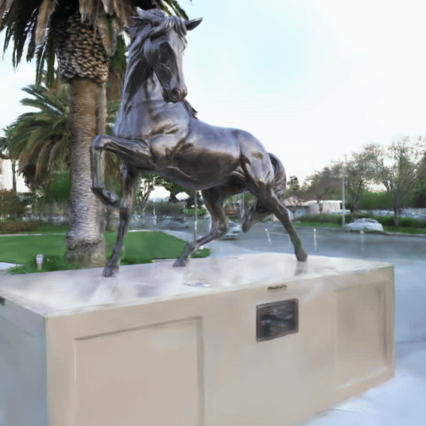
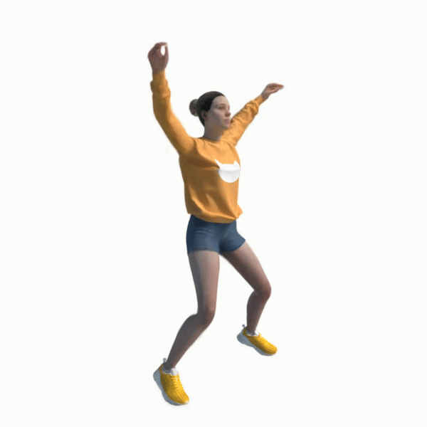
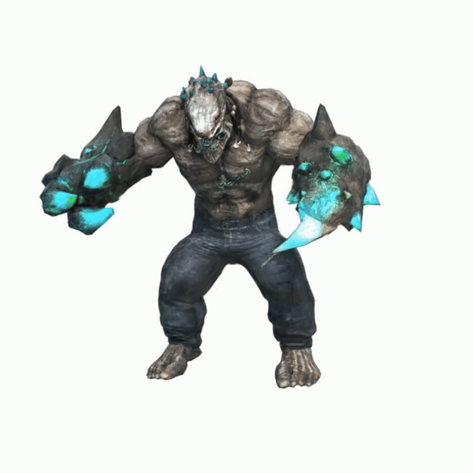
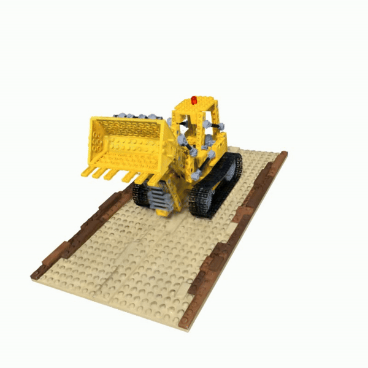
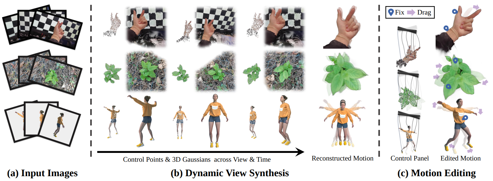
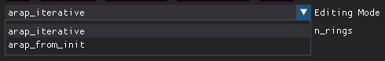
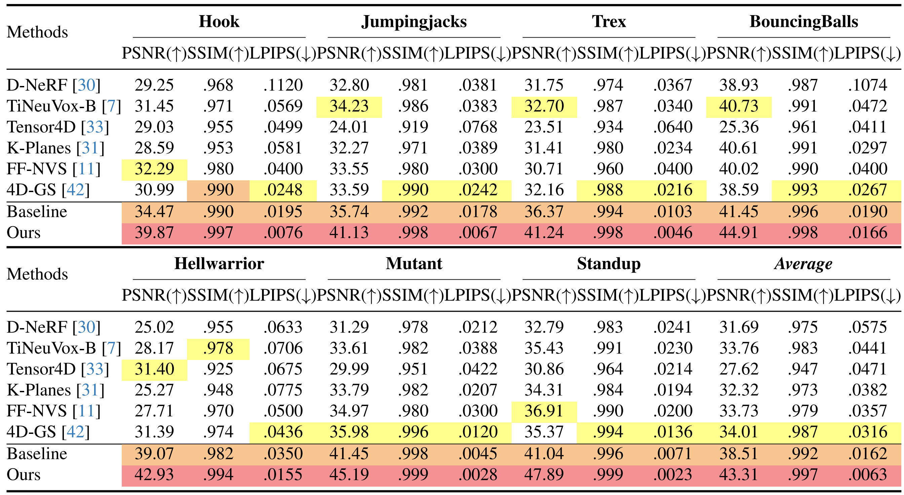

<h1 align="center">
  SC-GS: Sparse-Controlled Gaussian Splatting for Editable Dynamic Scenes

  <a href="https://www.hku.hk/"> </a>
  <a href="https://github.com/VAST-AI-Research/"> </a>
  <a href="https://www.zju.edu.cn/english/"> </a> 
</h1>

This is the code for SC-GS: Sparse-Controlled Gaussian Splatting for Editable Dynamic Scenes.

<div align="center">
  
[](https://yihua7.github.io/SC-GS-web/)
[](https://arxiv.org/abs/2312.14937)

</div>

<div align="center">
  
  
  
  
</div>

<div align="center">
  
  
  
  
</div>

*With interactive editing empowered by SC-GS, users can effortlessly edit and customize their digital assets with interactive editing features.*

<div align="center">
  
</div>

*Given (a) an image sequence from a monocular dynamic video, we propose to represent the motion with a set of sparse control points, which can be used to drive 3D Gaussians for high-fidelity rendering.Our approach enables both (b) dynamic view synthesis and (c) motion editing due to the motion representation based on sparse control points*


## Updates

### 2024-03-17: 

1. Editing **static scenes** is now supported! Simply include the `--is_scene_static` argument and you are good to go!

2. Video rendering is now supported with interpolation of editing results. Press the button `sv_kpt` to save each edited result and press `render_traj` to render the interpolated motions as a video. Click the `spiral` to switch the camera-motion pattern of the rendered video between a spiral trace and a fixed pose.

3. On self-captured real-world scenes where Gaussian number will be too large, the dimension of hyper coordinates that seperate close but disconnected parts can be set to 2 to speed up the rendering: ` --hyper_dim 2`. Also remember to remove `--is_blender` in such cases!

### 2024-03-07

We offer two ARAP deformation strategies for motion editing: 1. iterative deformation and 2. deformation from Laplacian initialization.

### 2024-03-06

To prevent initialization failure of control points, you use the argument `--init_isotropic_gs_with_all_colmap_pcl` on self-captured datasets.


## Install

```bash
git clone https://github.com/yihua7/SC-GS --recursive
cd SC-GS

pip install -r requirements.txt

# a modified gaussian splatting (+ depth, alpha rendering)
pip install ./submodules/diff-gaussian-rasterization

# simple-knn
pip install ./submodules/simple-knn
```

## Run

### Train wit GUI

* To begin the training, select the 'start' button. The program will begin with pre-training control points in the form of Gaussians for 10,000 steps before progressing to train dynamic Gaussians.

* To view the control points, click on the 'Node' button found on the panel located after 'Visualization'.

```bash
# Train with GUI (for the resolution of 400*400 with best PSNR)
CUDA_VISIBLE_DEVICES=0 python train_gui.py --source_path YOUR/PATH/TO/DATASET/jumpingjacks --model_path outputs/jumpingjacks --deform_type node --node_num 512 --hyper_dim 8 --is_blender --eval --gt_alpha_mask_as_scene_mask --local_frame --resolution 2 --W 800 --H 800 --gui

# Train with GUI (for the resolution of 800*800)
CUDA_VISIBLE_DEVICES=0 python train_gui.py --source_path YOUR/PATH/TO/DATASET/jumpingjacks --model_path outputs/jumpingjacks --deform_type node --node_num 512 --hyper_dim 8 --is_blender --eval --gt_alpha_mask_as_scene_mask --local_frame --W 800 --H 800 --random_bg_color --white_background --gui
```

### Train with terminal

* Simply remove the option `--gui` as following:

```bash
# Train with terminal only (for the resolution of 400*400 with best PSNR)
CUDA_VISIBLE_DEVICES=0 python train_gui.py --source_path YOUR/PATH/TO/DATASET/jumpingjacks --model_path outputs/jumpingjacks --deform_type node --node_num 512 --hyper_dim 8 --is_blender --eval --gt_alpha_mask_as_scene_mask --local_frame --resolution 2 --W 800 --H 800
```

### Evalualuate

* Every 1000 steps during the training, the program will evaluate SC-GS on the test set and print the results **on the UI interface and terminal**. You can view them easily.

* You can also run the evaluation command by replacing `train_gui.py` with `render.py` in the command of training. Results will be saved in the specified log directory `outputs/XXX`. The following is an example:

```bash
# Evaluate with GUI (for the resolution of 400*400 with best PSNR)
CUDA_VISIBLE_DEVICES=0 python render.py --source_path YOUR/PATH/TO/DATASET/jumpingjacks --model_path outputs/jumpingjacks --deform_type node --node_num 512 --hyper_dim 8 --is_blender --eval --gt_alpha_mask_as_scene_mask --local_frame --resolution 2 --W 800 --H 800
```

## Editing

### 2 min editing guidance:

(The video was recorded prior to the addition of the editing mode selection menu in the UI. In the video, the deformation was performed using the `arap_from_init` method.)

https://github.com/yihua7/SC-GS/assets/35869256/7a71d29b-975e-4870-afb1-7cdc96bb9482

### Editing Mode

We offer two deformation strategies for editing: **(1)** iterative ARAP deformation and **(2)** ARAP starts with the initial frozen moment. Users can select their preferred strategy from the Editing Mode drop-down menu on the UI interface.



(1) **Iterative deformation (`arap_iterative`)**:

- **Pros**: It allows easy achievement of large-scale deformation without rotating artifacts.

- **Cons**: It may be difficult to revert to the previous state after unintentionally obtaining unwanted deformations due to the iterative state update.

(2) **Deformation from the initial frozen moment (`arap_from_init`)**:

- **Pros**: It ensures that the deformed state can be restored when control points return to their previous positions, making it easier to control without deviation.

- **Cons**: For large-scale rotational deformation, ARAP algorithm may fail to achieve the optimum since the initialization from the Laplace deformation is not robust to deal with rotation. This may result in certain areas not experiencing corresponding large-scale rotations.

**Users can personally operate and experience the differences between the two strategies. They can then choose the most suitable strategy to achieve their desired editing effect.**

### Tips on Editing with the deformation from the initial frozen moment (`arap_from_init`)

1. **When and why will artifacts appear when using `arap_from_init`?** Most artifacts of editing are caused by the inaccurate initialization of ARAP deformation, which is an iterative optimization process of position and rotation. To optimize both position and rotation to a global optimum, a good initialization of ARAP is highly required. The mode `arap_from_init` uses Laplacian deformation for initialization, which only minimizes the error of the Laplacian coordinate that changes related to rotation. Hence Laplacian deformation is not robust enough for rotation, resulting in inaccurate initialization in the face of large rotation. As a result, some areas fail to achieve correct rotations in subsequent ARAP deformation results.

2. **How to deal with artifacts?** To address this issue, the following steps are recommended, of which the core idea is to **include as many control points as possible** for large-scale deformation: (1) If you treat a big region as a rigid part and would like to apply a large deformation, use more control points to include the whole part and manipulate these control points to deform. This allows for a better Laplacian deformation result and better initialization of ARAP deformation. (2) Edit hierarchically. If you need to apply deformation of different levels, please first add control points at the finest part and deform it. After that, you can include more control points; treat them as a rigid body; and perform deformation of larger levels.

3. More tips: (1) To more efficiently add handle points, you can set the parameter `n_rings` to 3 or 4 on the GUI interface. (2) You can press `Node` button to visualize control points and check if there are any points in the region of interest missed. Press `RGB` to switch back the Gaussian rendering.

4. The above are some operational tricks for editing with `arap_from_init`, which require a sufficient understanding of ARAP deformation or more practice and attempts. This will allow for a clearer understanding of how to operate and achieve the desired deformation results.

## SOTA Performance

Quantitative comparison on D-NeRF datasets. We present the average PSNR/SSIM/LPIPS (VGG) values for novel view synthesis on dynamic scenes from D-NeRF, with each cell colored to indicate the best, second best, and third best.
<div align="center">
  
</div>

## Dataset

Our datareader script can recognize and read the following dataset format automatically:

* [D-NeRF](https://www.albertpumarola.com/research/D-NeRF/index.html): dynamic scenes of synthetic objects ([download](https://www.dropbox.com/s/0bf6fl0ye2vz3vr/data.zip?e=1&dl=0))

* [NeRF-DS](https://jokeryan.github.io/projects/nerf-ds/): dynamic scenes of specular objects ([download](https://github.com/JokerYan/NeRF-DS/releases/tag/v0.1-pre-release))

* Self-captured videos: 1. install [MiVOS](https://github.com/hkchengrex/MiVOS) and place [interactive_invoke.py](data_tools/interactive_invoke.py) under the installed path. 2. Set the video path in [phone_catch.py](data_tools/phone_catch.py) and run ```python ./data_tools/phone_catch.py``` to achieve frame extraction, video segmentation, and COLMAP pose estimation in sequence. Please refer to [NeRF-Texture](https://github.com/yihua7/NeRF-Texture) for detailed tutorials.

* Static self-captured scenes: For self-captured static scenes, editing is now also supported! Simply include the `--is_scene_static` argument and you are good to go!

**Important Note for Using Self-captured Videos**: 

* Please remember to remove `--is_blender` option in your command, which causes the control points to be initialized from random point clouds instead of COLMAP point clouds. 
* Additionally, you can remove `--gt_alpha_mask_as_scene_mask` and add `--gt_alpha_mask_as_dynamic_mask --gs_with_motion_mask` if you want to model both the dynamic foreground masked by MiVOS and the static background simultaneously.
* If removing `--is_blender` still meets the failure of control point initialization, please use the option: `--init_isotropic_gs_with_all_colmap_pcl`. This will initialize the isotropic Gaussians with all COLMAP point clouds, which can help avoid the risk of control points becoming extinct.
* The dimension of hyper coordinates that seperate close but disconnected parts can be set to 2 to avoid the slow rendering: `--hyper_dim 2`.


## Acknowledgement

* This framework has been adapted from the notable [Deformable 3D Gaussians](https://github.com/ingra14m/Deformable-3D-Gaussians), an excellent and pioneering work by [Ziyi Yang](https://github.com/ingra14m).
```
@article{yang2023deformable3dgs,
    title={Deformable 3D Gaussians for High-Fidelity Monocular Dynamic Scene Reconstruction},
    author={Yang, Ziyi and Gao, Xinyu and Zhou, Wen and Jiao, Shaohui and Zhang, Yuqing and Jin, Xiaogang},
    journal={arXiv preprint arXiv:2309.13101},
    year={2023}
}
```

* Credits to authors of [3D Gaussians](https://repo-sam.inria.fr/fungraph/3d-gaussian-splatting/) for their excellent code.
```
@Article{kerbl3Dgaussians,
      author       = {Kerbl, Bernhard and Kopanas, Georgios and Leimk{\"u}hler, Thomas and Drettakis, George},
      title        = {3D Gaussian Splatting for Real-Time Radiance Field Rendering},
      journal      = {ACM Transactions on Graphics},
      number       = {4},
      volume       = {42},
      month        = {July},
      year         = {2023},
      url          = {https://repo-sam.inria.fr/fungraph/3d-gaussian-splatting/}
}
```

## Citing
If you find our work useful, please consider citing:
```BibTeX
@article{huang2023sc,
  title={SC-GS: Sparse-Controlled Gaussian Splatting for Editable Dynamic Scenes},
  author={Huang, Yi-Hua and Sun, Yang-Tian and Yang, Ziyi and Lyu, Xiaoyang and Cao, Yan-Pei and Qi, Xiaojuan},
  journal={arXiv preprint arXiv:2312.14937},
  year={2023}
}
```
